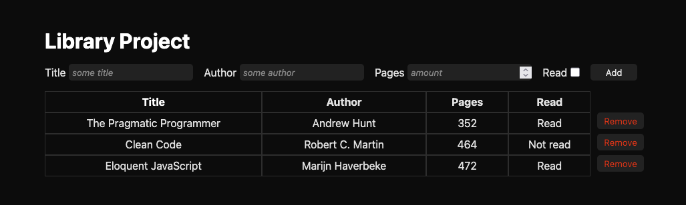

# Library Project

Simple library manager built for The Odin Project, allowing users to add and track books through a lightweight in-browser interface.

## Live Demo

[https://gloffler.github.io/top-library](https://gloffler.github.io/top-library/)

## Features

- Capture books with title, author, page count, and read status flag
- Render entries into a table once they are stored in memory
- Remove rows from the table through per-row buttons

## Getting Started

1. Clone or download this repository.
2. Open `index.html` in any modern browser.
3. Use the form at the top to add books; entries appear immediately in the table below.

## Project Structure

- `index.html` – Main markup containing the form and table
- `style.css` – Styling for the layout and table
- `library.js` – Application logic, including the `Book` constructor and DOM manipulation helpers

## Development Notes

- Books are stored in a simple array and re-rendered by `updateLibrary()` whenever entries change.
- Remove buttons detach rows from the DOM; if you re-run `updateLibrary()` (e.g., when adding a new book), the removed entry will reappear because it still lives in memory—see enhancement ideas below.

## Potential Enhancements

- Persist the library in `localStorage` to retain books between sessions
- Add a “toggle read status” action directly in the table
- Replace the alert validation with inline form error messaging
- Wrap inputs in an HTML form to support submission via Enter key
